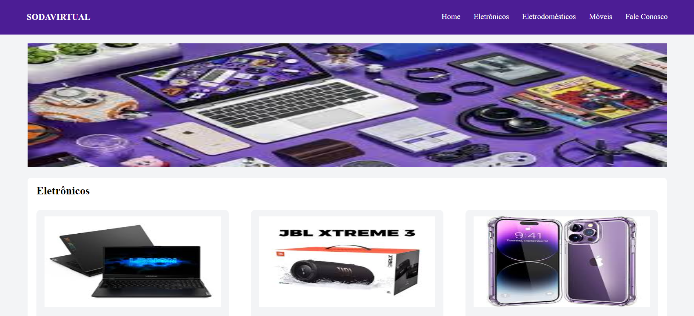

<h1 align="center"> Soda Virtual </h1>

Interface front-end desenvolvida para aprimoramento das habilidades de acessibilidade e responsividade.

  <a href="#-tecnologias">Tecnologias</a>&nbsp;&nbsp;&nbsp;|&nbsp;&nbsp;&nbsp;
  <a href="#-projeto">Projeto</a>&nbsp;&nbsp;&nbsp;|&nbsp;&nbsp;&nbsp;
  <a href="#memo-licença">Licença</a>

  

 

  

## 🚀 Tecnologias

Esse projeto foi desenvolvido com as seguintes tecnologias:

- [TypeScript](https://www.typescriptlang.org/)
- [Node e NPM](https://nodejs.org/)
- [Vite](https://vitejs.dev/)
- [React](https://react.dev/)
- [TailwindCSS](https://tailwindcss.com/)

## 💻 Projeto

O SodaVirtual é uma interface que simula um e-commerce de produtos diversos. Neste projeto apenas desenvolvi a parte inicial do projeto, onde apresentamos de forma responsiva produtos por categoria. 
A apresentação dos produtos é realizada de forma dinâmica através de um array de objetos que redenriza o componente {Card}. 
Adicionamos um arquivo Dockerfile para virtualização do projeto.

## :memo: Licença

Esse projeto está sob a licença MIT.

---

Projeto desenvolvido por @peusodati. Aceitamos contribuições.
